# Styleguide

The Project utilizes [Material Design 3](https://m3.material.io/) and uses
Standard [Components](https://m3.material.io/components) offered via the
official [compose library](https://developer.android.com/develop/ui/compose/components).

## Colors

The Project follows
the [Material 3 Color System](https://m3.material.io/styles/color/system/overview) and uses Color
Tokens instead of direct color references using
the [Compose Material Theme](https://developer.android.com/develop/ui/compose/designsystems/material3#material-theming).

|                           | Light     | Dark      |
|---------------------------|-----------|-----------|
| Primary                   | `#4C662B` | `#B2D189` |
| On Primary                | `#FFFFFF` | `#203701` |
| Primary Container         | `#CDEDA3` | `#354E15` |
| On Primary Container      | `#102000` | `#CDEDA3` |
| Secondary                 | `#586249` | `#C0CBAC` |
| On Secondary              | `#FFFFFF` | `#2A331E` |
| Secondary Container       | `#DCE7C7` | `#404A33` |
| On Secondary Container    | `#161E0B` | `#DCE7C7` |
| Tertiary                  | `#386663` | `#A0D0CB` |
| On Tertiary               | `#FFFFFF` | `#003734` |
| Tertiary Container        | `#BCECE7` | `#1F4E4B` |
| On Tertiary Container     | `#00201E` | `#BCECE7` |
| Error                     | `#BA1A1A` | `#FFB4AB` |
| On Error                  | `#FFFFFF` | `#690005` |
| Error Container           | `#FFDAD6` | `#93000A` |
| On Error Container        | `#410002` | `#FFDAD6` |
| background                | `#F9FAEF` | `#12140E` |
| On Background             | `#1A1C16` | `#E2E3D8` |
| Surface                   | `#F9FAEF` | `#12140E` |
| On Surface                | `#1A1C16` | `#E2E3D8` |
| Surface Variant           | `#E1E4D5` | `#44483D` |
| On Surface Variant        | `#44483D` | `#C5C8BA` |
| Outline                   | `#75796C` | `#8F9285` |
| Outline Variant           | `#C5C8BA` | `#44483D` |
| Scrim                     | `#000000` | `#000000` |
| Inverse Surface           | `#2F312A` | `#E2E3D8` |
| Inverse On Surface        | `#F1F2E6` | `#2F312A` |
| Inverse Primary           | `#B2D189` | `#4C662B` |
| Surface Dim               | `#DADBD0` | `#12140E` |
| Surface Bright            | `#F9FAEF` | `#383A32` |
| Surface Container Lowest  | `#FFFFFF` | `#0D0F09` |
| Surface Container Low     | `#F3F4E9` | `#1A1C16` |
| Surface Container         | `#EEEFE3` | `#1E201A` |
| Surface Container High    | `#E8E9DE` | `#282B24` |
| Surface Container Highest | `#E2E3D8` | `#33362E` |

## Typography

The Project follows the [Material 3 Typography](https://m3.material.io/styles/typography/overview)
and uses Type Tokens instead of direct declaration using
the [Compose Material Theme](https://developer.android.com/develop/ui/compose/designsystems/material3#material-theming).

| Texst Style     | Font Family           | Line Height | Font Size | Letter Spacing |
|-----------------|-----------------------|-------------|-----------|----------------|
| Display Large   | Nunito Sans Bold      | 64 SP       | 57 SP     | -0.2 SP        |
| Display Medium  | Nunito Sans Bold      | 52 SP       | 45 SP     | 0 SP           |
| Display Small   | Nunito Sans Bold      | 44 SP       | 36 SP     | 0 SP           |
| Headline Large  | Nunito Sans Semi Bold | 40 SP       | 32 SP     | 0 SP           |
| Headline Medium | Nunito Sans Semi Bold | 36 SP       | 28 SP     | 0 SP           |
| Headline Small  | Nunito Sans Semi Bold | 32 SP       | 24 SP     | 0 SP           |
| Title Large     | Nunito Sans Semi Bold | 28 SP       | 22 SP     | 0 SP           |
| Title Medium    | Nunito Sans Bold      | 24 SP       | 16 SP     | 0.2 SP         |
| Title Small     | Nunito Sans Regular   | 20 SP       | 14SP      | 0.2 SP         |
| Body Large      | Nunito Sans Semi Bold | 24 SP       | 16 SP     | 0.5 SP         |
| Body Medium     | Nunito Sans Regular   | 20 SP       | 14 SP     | 0.2 SP         |
| Body Small      | Nunito Sans Light     | 16 SP       | 12 SP     | 0.4 SP         |
| Label Large     | Nunito Sans Semi Bold | 20 SP       | 14 SP     | 0.1 SP         | 
| Label Medium    | Nunito Sans Regular   | 16 SP       | 12 SP     | 0.5 SP         |
| Label Small     | Nunito Sans Light     | 16 SP       | 11 SP     | 0.5 SP         |

## Home Screen

| Light                                           | Dark                                          |
|-------------------------------------------------|-----------------------------------------------|
| 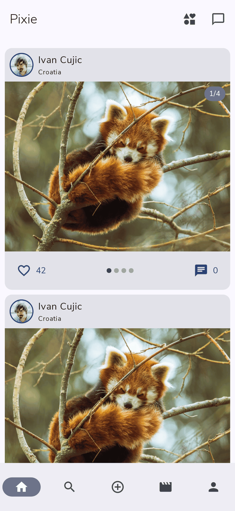 | 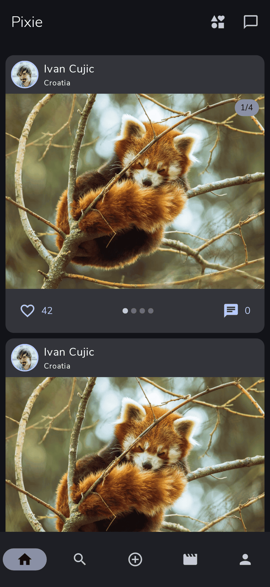 |

### Behavior

- Posts list should be scrollable:
    - The top app bar remains fixed.
    - The bottom navigation bar remains fixed.
- While loading posts, display a centered loading indicator.

### Components

#### Top App Bar

| Light                                             | Dark                                            |
|---------------------------------------------------|-------------------------------------------------|
| 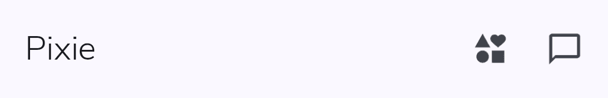 | 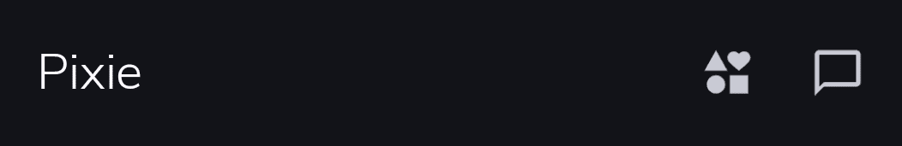 |

##### Icons

- Action 1: `Icons.Default.Interests`
- Action 2: `Icons.Default.ChatBubbleOutline`

##### Behavior

- Both actions should be clickable, but no action is required.

#### Post Component

| Single Image                                              | Multiple Images                                                 | Two Comments                                              | Multiple Comments                                                   |
|-----------------------------------------------------------|-----------------------------------------------------------------|-----------------------------------------------------------|---------------------------------------------------------------------|
|      | 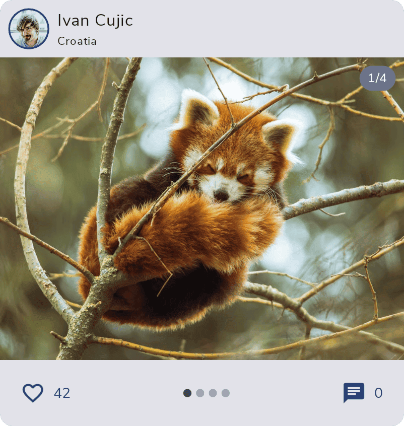     | 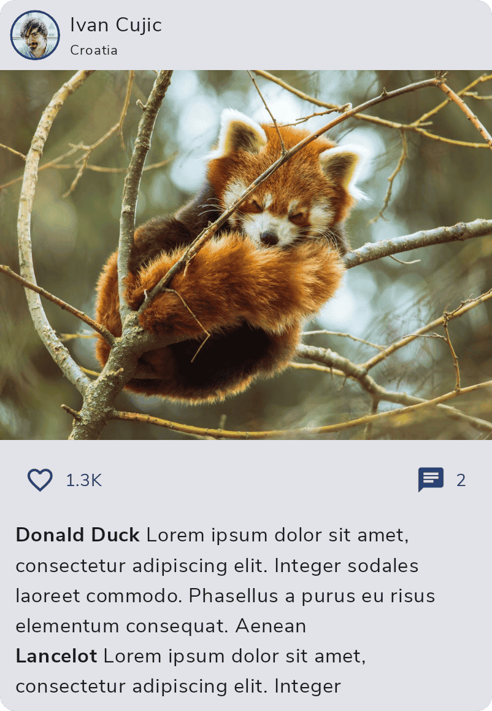     | 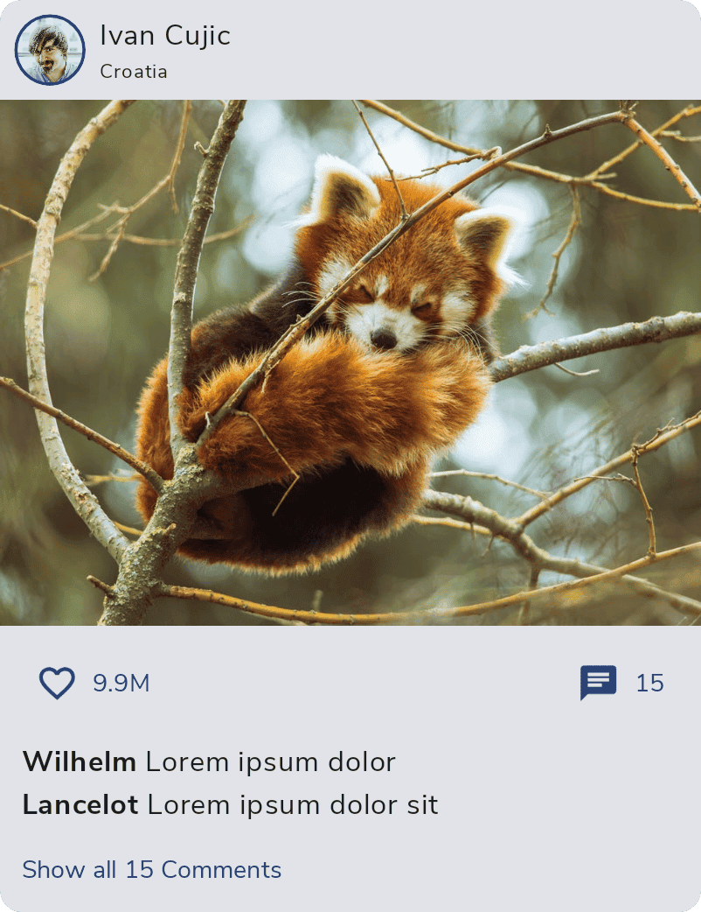     |
|  | 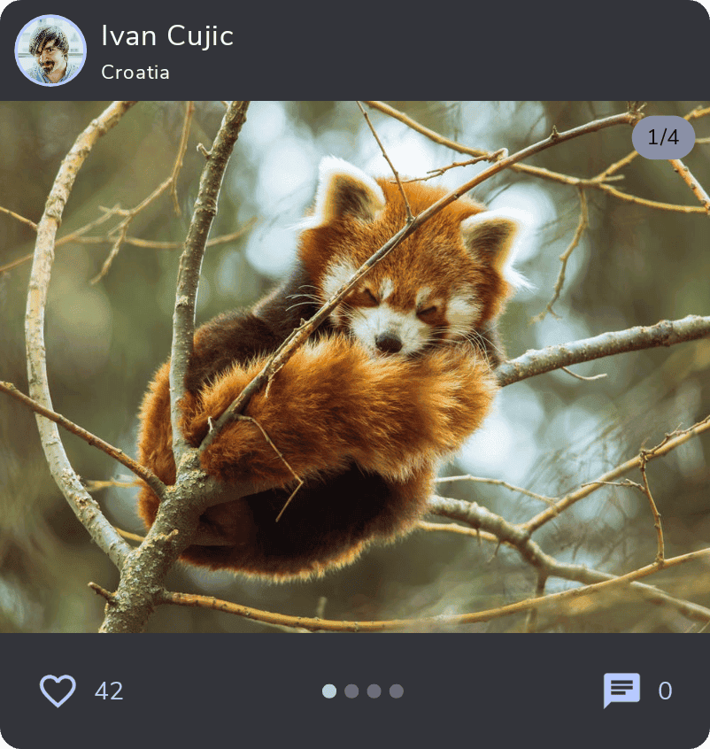 | 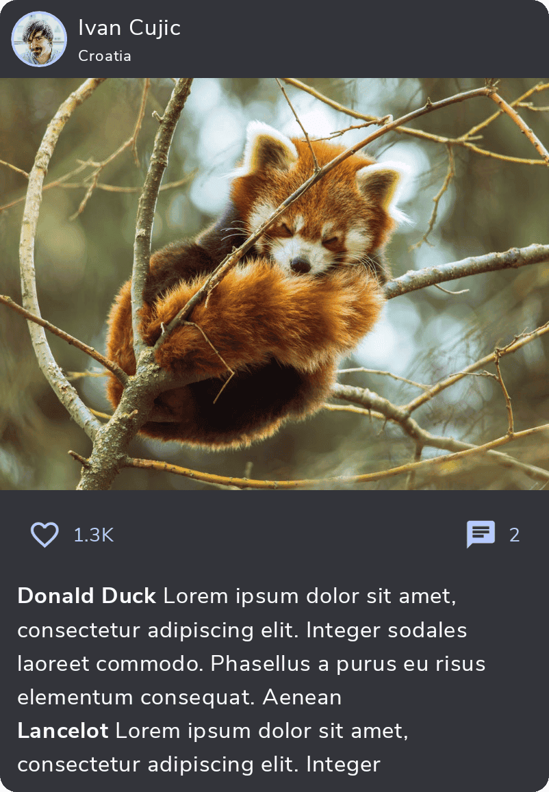 | 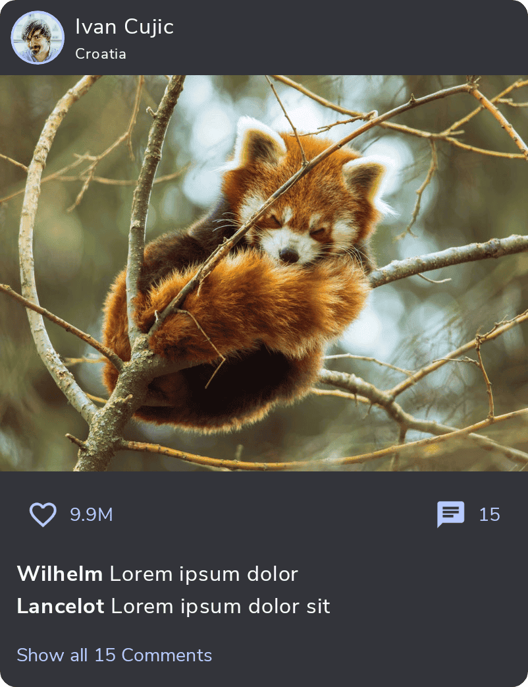 |

##### Typography

- **User Name**: `Body Large`
- **User Location**: `Label Small`
- **Page Label**: `Body Small`
- **Comments**: `Body Medium`
    - User name in comments should be bold.

##### Colors

- **Profile Picture Border**: `Primary`
- **Page Label Background**: `Secondary Container`
- **Current Page Indicator**:
    - Active page: `Secondary`
    - Other pages: `Secondary` (38% alpha)

##### Icons

- **Likes**:
    - Not liked: `Icons.Default.FavoriteBorder`
    - Liked: `Icons.Default.Favorite`
- **Comments**: `Icons.AutoMirrored.Filled.Chat`

##### Behavior

- Clicking a user name or profile picture navigates to the user's [Profile](#Profile-Screen) screen.
- Clicking the like button marks the post as liked and increases the like count by one.

#### Bottom App Bar

| Light                                              | Dark                                             |
|----------------------------------------------------|--------------------------------------------------|
| 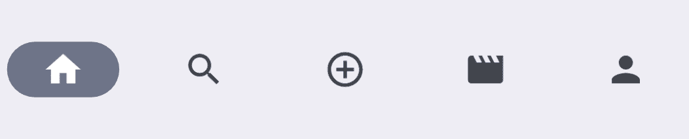 | 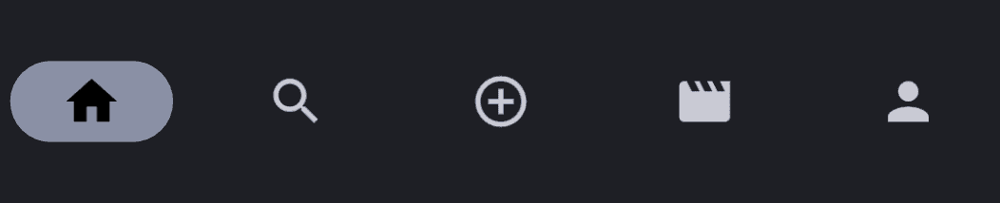 |

##### Icons

- Action 1: `Icons.Default.Home`
- Action 2: `Icons.Default.Search`
- Action 3: `Icons.Default.AddCircleOutline`
- Action 4: `Icons.Default.Movie`
- Action 5: `Icons.Default.Person`

##### Behavior

- All icons should be clickable, but no action is required.
- The first item should always be displayed as active.

---

## Profile Screen

| Light                                          | Dark                                         |
|------------------------------------------------|----------------------------------------------|
| 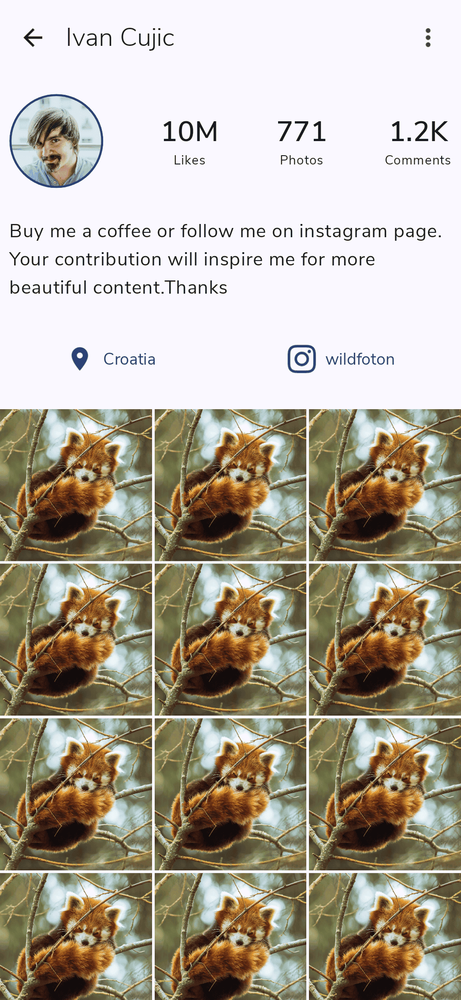 | 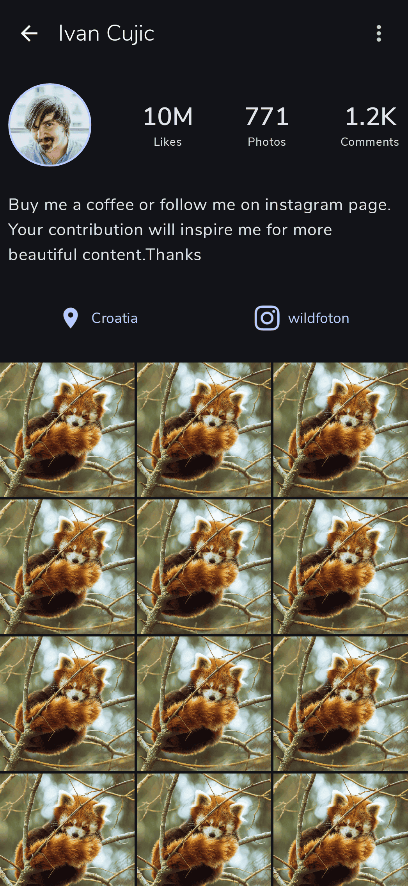 |

### Behavior

- The profile screen should be scrollable:
    - The top app bar remains fixed.
- While loading user details, display a centered loading indicator.
- If the user cannot be found, display an error message.

### Components

#### Top App Bar

| Light                                                   | Dark                                                  |
|---------------------------------------------------------|-------------------------------------------------------|
| 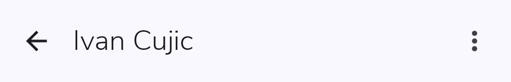 | 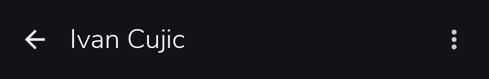 |

##### Icons

- Navigation: `Icons.AutoMirrored.Filled.ArrowBackt`
- Action: `Icons.Default.MoreVert`

##### Behavior

- The Navigation Icon should be clickable and navigate to the Previous Screen
- The action should be clickable, but no action is required.

#### Statistics

| Light                                                 | Dark                                                |
|-------------------------------------------------------|-----------------------------------------------------|
| 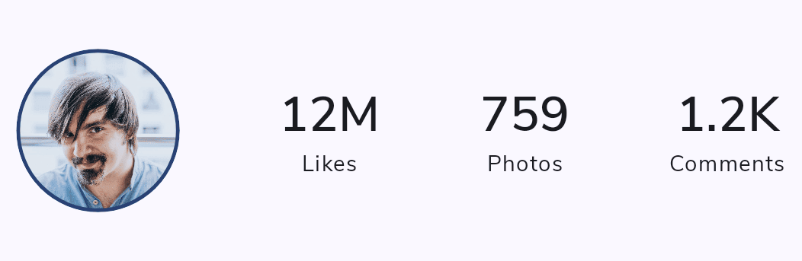 | 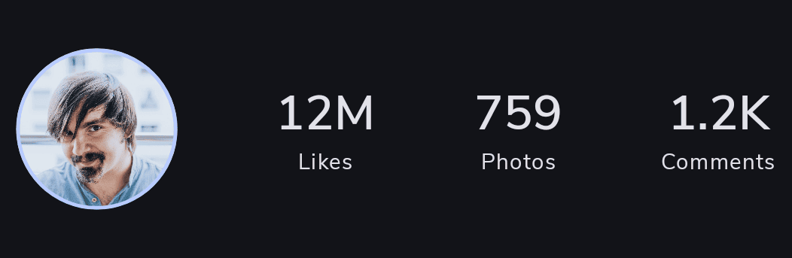 |

##### Typography

- **Statistic Value**: `Headline Small`
- **Statistic Name**: `Label Small`

##### Colors

- **Profile Picture Border**: `Primary`

#### Links

| Both                                                          | Only Location                                                         | Only Instagram                                                          |
|---------------------------------------------------------------|-----------------------------------------------------------------------|-------------------------------------------------------------------------|
| 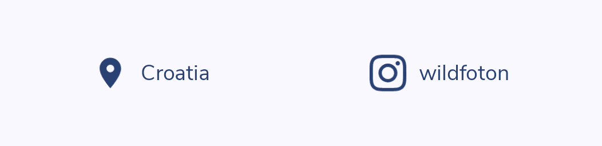 | 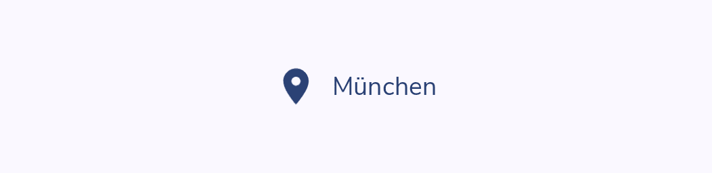 | 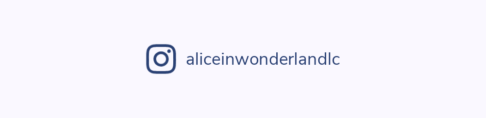 |
| 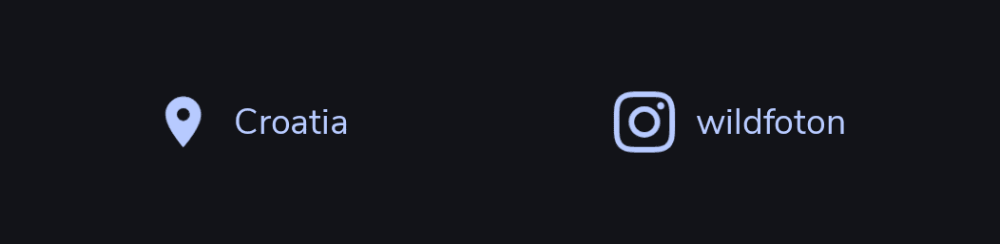   | 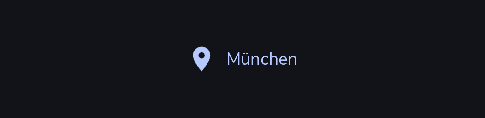   | 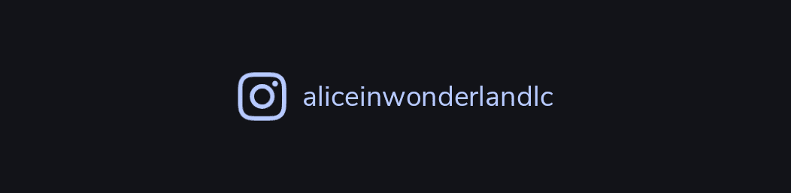   |

##### Icons

- **Location**: `Icons.Default.LocationOn`
- **Instagram**: `PixieIcons.Instagram`

##### Behavior

- Clicking on the location should [Search the Location in Maps](https://developers.google.com/maps/documentation/urls/android-intents#search-for-a-location)
- Clicking on the Instagram Username should open Instagram with the specific User Profile
  - The Url Schema is: `https://www.instagram.com/username` 

#### Photos Grid

| Few Photos                                    | Many Photos                                     |
|-----------------------------------------------|-------------------------------------------------|
| 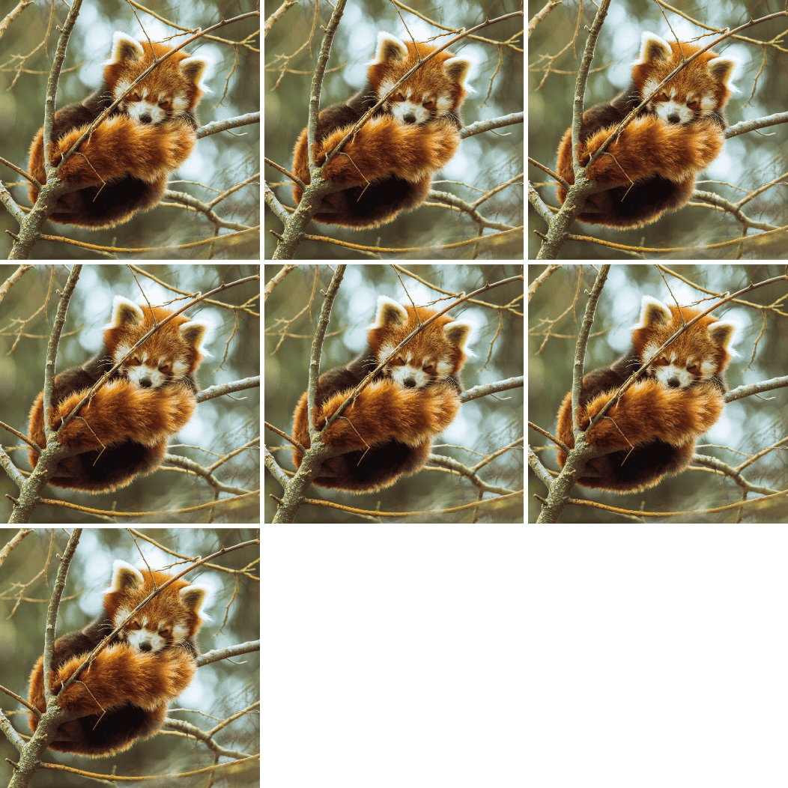 | 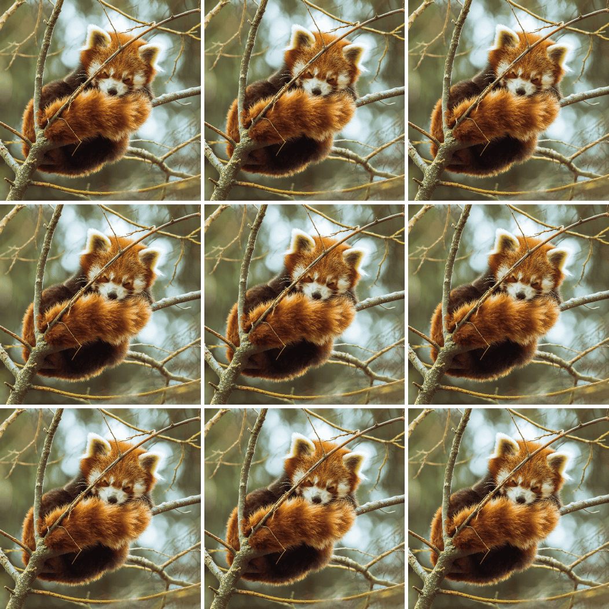 |

##### Behavior

- The grid should display 3 photos per row, regardless of screen size.
    - Photo size should adapt to available space, maintaining a 1:1 aspect ratio.

